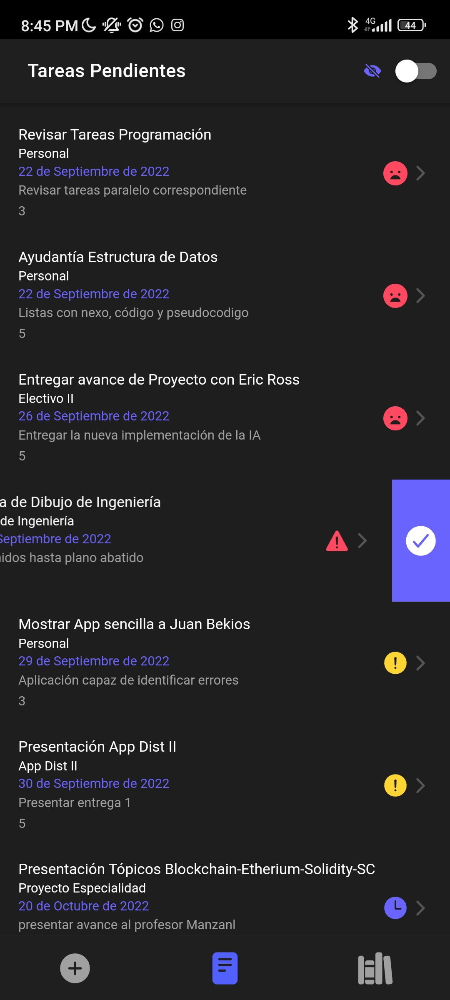
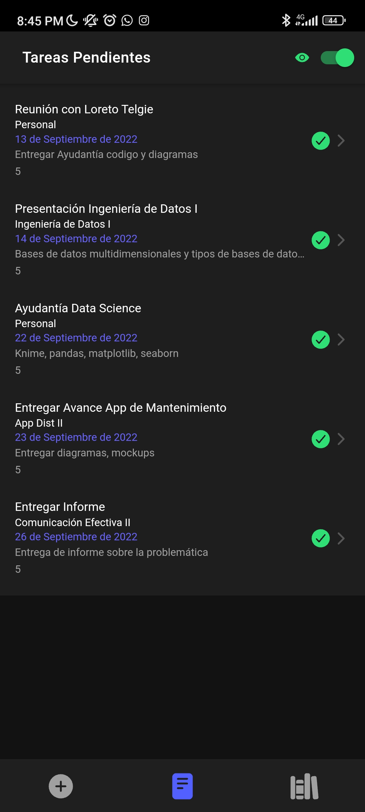
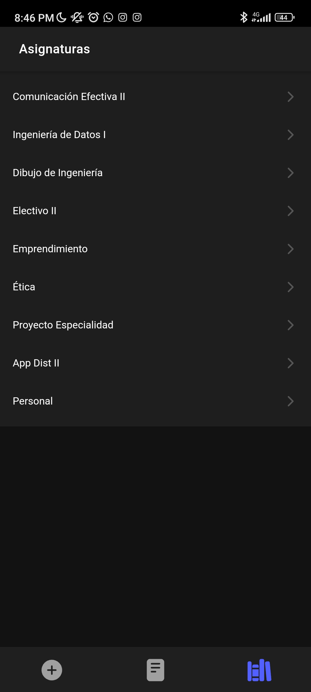
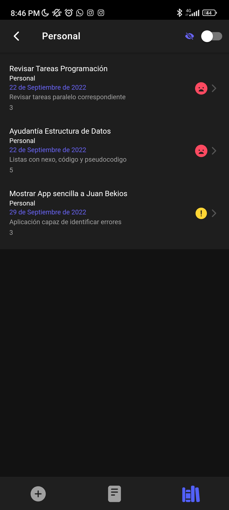
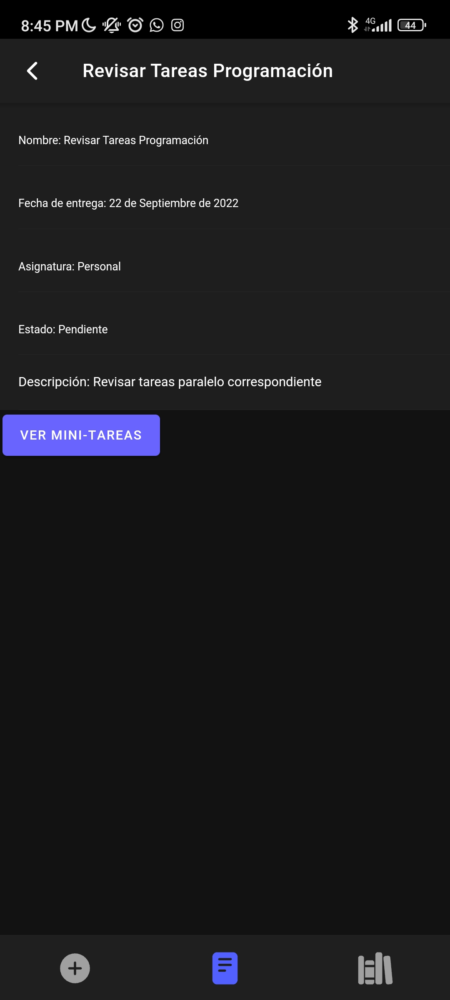
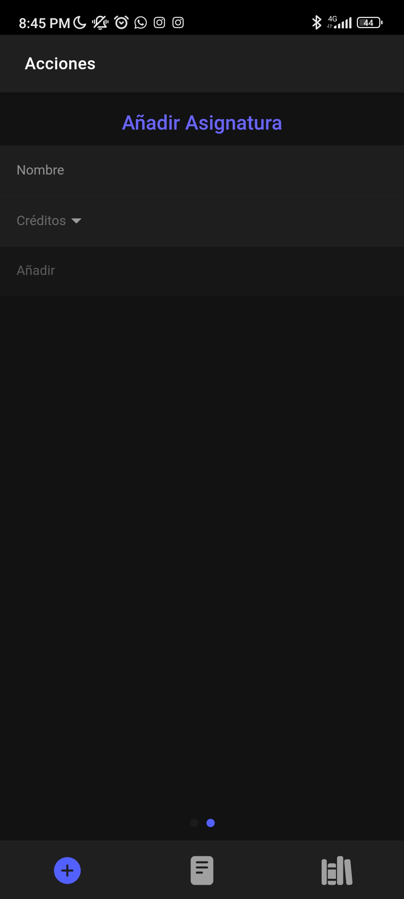
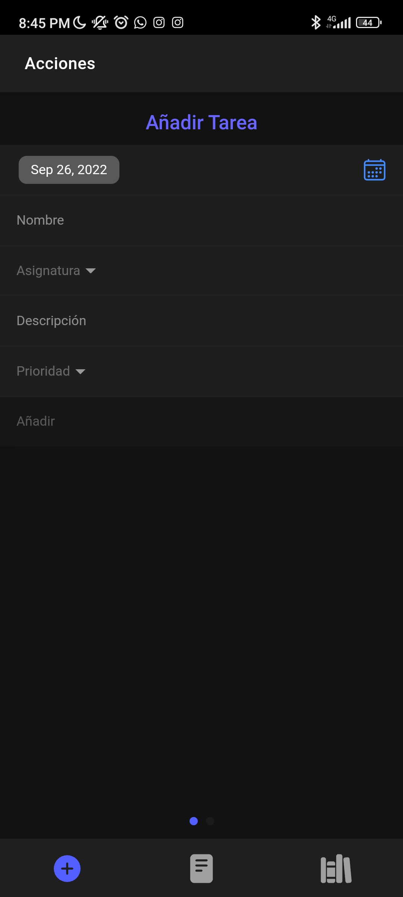
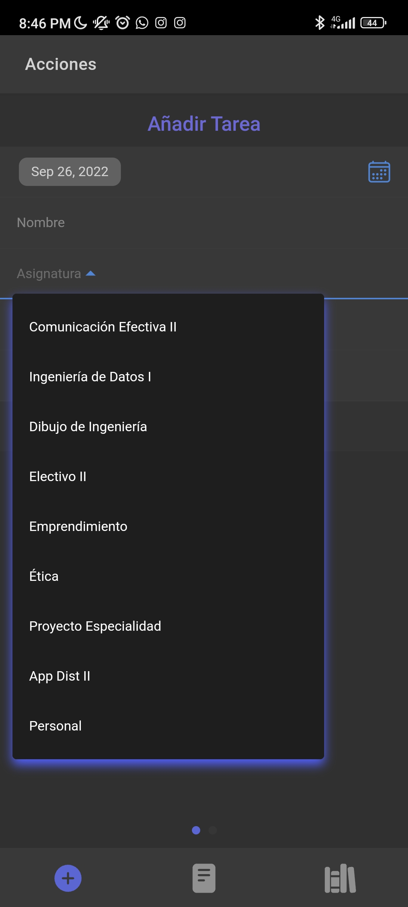

# Título del Proyecto

Esta aplicación nació por dos razones:

1. Me ha costado mucho encontrar una aplicación de este tipo que me entregue lo que necesito, ver las tareas de mis asignaturas de la universidad, sin anuncios, etc.
2. Al ser un proyecto relativamente 'sencillo' lo utilicé como excusa para aprender Ionic.
   La aplicación se basa en un To-Do List orientado netamente hacia los estudios, permite guardar asignaturas, tareas correspondientes a las asignaturas y las ordena por relevancia y fecha.

## Comenzando 🚀

Para poder compilar la aplicación, debera copiar el repositorio e instalar los node_modules, tambien puede abrir la carpeta android/ios directamente en sus respectivos editores de texto y compilarla.

### Pre-requisitos 📋

```
NodeJS
Android Studio -> Para compilar para ANDROID
XCODE -> Para compilar para IOS
```

## Construido con 🛠️

- [Node.js](https://nodejs.org) -> Entorno de ejecución
- [Ionic](https://ionicframework.com) -> Framework para aplicaciones hibridas
- [TypeScript](https://www.typescriptlang.org) -> Lenguaje de programación

## Imágenes 📷










## Autores ✒️

- **Cristian Galleguillos** - _creador y programador_ - [Shpm21](https://github.com/Shpm21)
